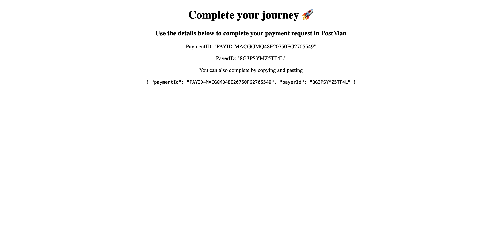

# Buying Images



Purchase Image



To complete an image purchase, you'll need to open the link in responses object;`HTTP method` tagged `REDIRECT` in a browser and follow prompted steps.






`imageId` of the image to purchase.





Bearer `{{ACCESS_TOKEN}}`










```
{
    "success": true,
    "data": {
        "id": "PAYID-MACGGMQ48E20750FG2705549",
        "intent": "sale",
        "state": "created",
        "payer": {
            "payment_method": "paypal"
        },
        "transactions": [
            {
                "amount": {
                    "total": "100.00",
                    "currency": "USD",
                    "details": {
                        "subtotal": "100.00"
                    }
                },
                "description": "You are paying for image: 60045d60f2e9150015d9ef1d from malcomxx",
                "custom": "SHOPFY_IMG_06263153839227",
                "invoice_number": "77492859724",
                "soft_descriptor": "SIMG7974808",
                "payment_options": {
                    "allowed_payment_method": "INSTANT_FUNDING_SOURCE",
                    "recurring_flag": false,
                    "skip_fmf": false
                },
                "item_list": {
                    "items": [
                        {
                            "name": "logniins",
                            "sku": "1",
                            "price": "100.00",
                            "currency": "USD",
                            "quantity": 1
                        }
                    ]
                },
                "related_resources": []
            }
        ],
        "note_to_payer": "Thank you for your interest in this image. Please, contact us for further assistance",
        "create_time": "2021-01-17T16:17:54Z",
        "links": [
            {
                "href": "https://api.sandbox.paypal.com/v1/payments/payment/PAYID-MACGGMQ48E20750FG2705549",
                "rel": "self",
                "method": "GET"
            },
            {
                "href": "https://www.sandbox.paypal.com/cgi-bin/webscr?cmd=_express-checkout&token=EC-9BY2012792675570A",
                "rel": "approval_url",
                "method": "REDIRECT"
            },
            {
                "href": "https://api.sandbox.paypal.com/v1/payments/payment/PAYID-MACGGMQ48E20750FG2705549/execute",
                "rel": "execute",
                "method": "POST"
            }
        ]
    },
    "message": "created successfully"
}
```






You'll need a PayPal account to complete the step. Here's one provided for you to test with:`<email: sb-lzjyu4739119@personal.example.com>` `<password: |i+TB8N,>`


## Completing an Image Purchase

If your PayPal payment was successful, you'll be redirected to a page that looks like so:



Kindly, copy the request above and paste request body.



Process Payment










Bearer `{{ACCESS_TOKEN}}`





`paymentId` from the redirect page



`payerId` from the redirect page







Get the watermark image download link from the response body.


```
{
    "success": true,
    "data": {
        "transaction": {
            "paidAmount": 100,
            "_id": "60046766f2e9150015d9ef28",
            "imageId": "60045d60f2e9150015d9ef1d",
            "metadata": {
                "sub_type": "purchase_image"
            },
            "transactionRef": "pyjjFIttzJ",
            "createdAt": "2021-01-17T16:35:50.444Z",
            "updatedAt": "2021-01-17T16:35:50.444Z",
            "__v": 0
        },
        "downloadLink": "https://api.cloudinary.com/v1_1/dhd3sqboy/image/download?timestamp=1610901351&public_id=shopify_internship_staging%2Femfe1uf3jduvuqbdw1ep&format=jpg&signature=0ea8c6b42d5d82e3a4e3dfc2052c4485143f35d0&api_key=969765432579286"
    },
    "message": "created successfully"
}
```





